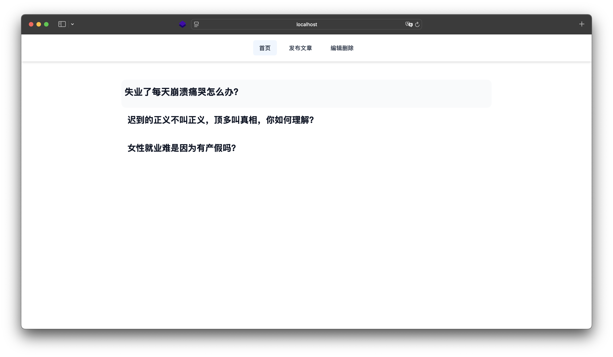
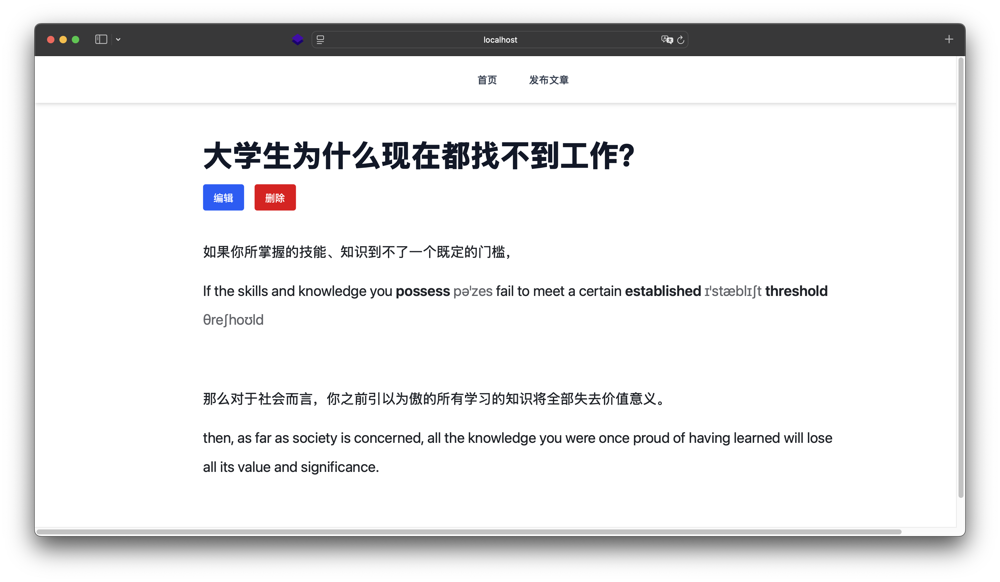
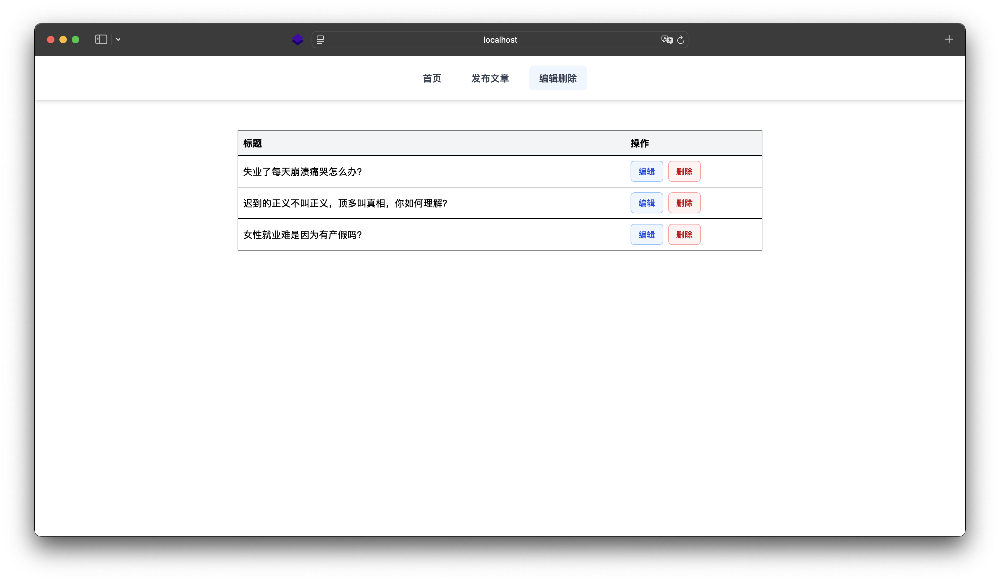

# 知乎收藏夹 · Vue + Node + MongoDB 

极简，入门用 

截图

技术栈
	•	前端：Vue 3 + Vite + Tailwind CSS
	•	后端：Express + MongoDB (Mongoose)
	•	Markdown 解析：marked.js

✅ 前端启动

安装依赖
npm install

启动前端开发服务器
npm run dev

⸻

✅ 后端启动

新开一个 VSCode 窗口，进入 server 目录（或后端所在目录）

安装依赖
npm install express mongoose cors dotenv

启动服务器
node index.js
