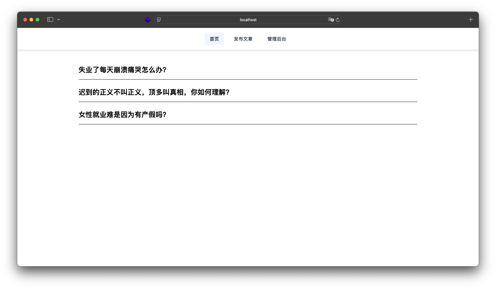
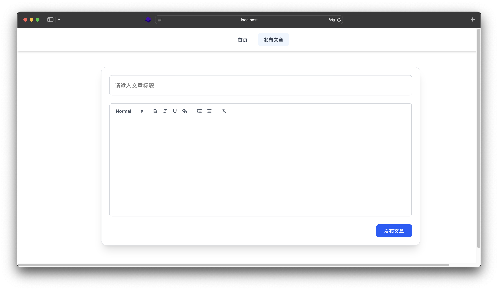

📝 知乎收藏夹 · Vue 3 + Vite 全栈入门项目

这是一个极简的全栈项目示例，适合初学者入门 Vue + Node + MongoDB。实现功能包括：
	•	📄 文章发布 / 浏览 / 编辑 / 删除
	•	🖋 Markdown 实时预览
	•	🧩 前后端分离，数据持久化到数据库

⸻

📷 项目截图

⸻

📦 技术栈
	•	前端：Vue 3 + Vite + Tailwind CSS
	•	后端：Express + MongoDB (Mongoose)
	•	Markdown 解析：marked.js

⸻

🚀 快速开始

✅ 前端启动

# 安装依赖
npm install

# 启动前端开发服务器
npm run dev

默认地址：http://localhost:5173

⸻

✅ 后端启动

# 重新打开一个 VSCode 窗口，进入 server 目录（或后端所在目录）

# 安装依赖
npm install express mongoose cors dotenv

# 启动服务器
node index.js

默认地址：http://localhost:3000

⸻

📌 功能特性
	•	首页自动加载所有文章列表
	•	支持 Markdown 实时预览和渲染
	•	后台支持编辑和删除文章
	•	所有文章持久化存储到 MongoDB

⸻

💡 提示
	•	推荐使用 MongoDB Compass 图形界面工具查看和管理数据。
	•	后端可通过 .env 文件自定义数据库连接字符串（需要手动添加）。
